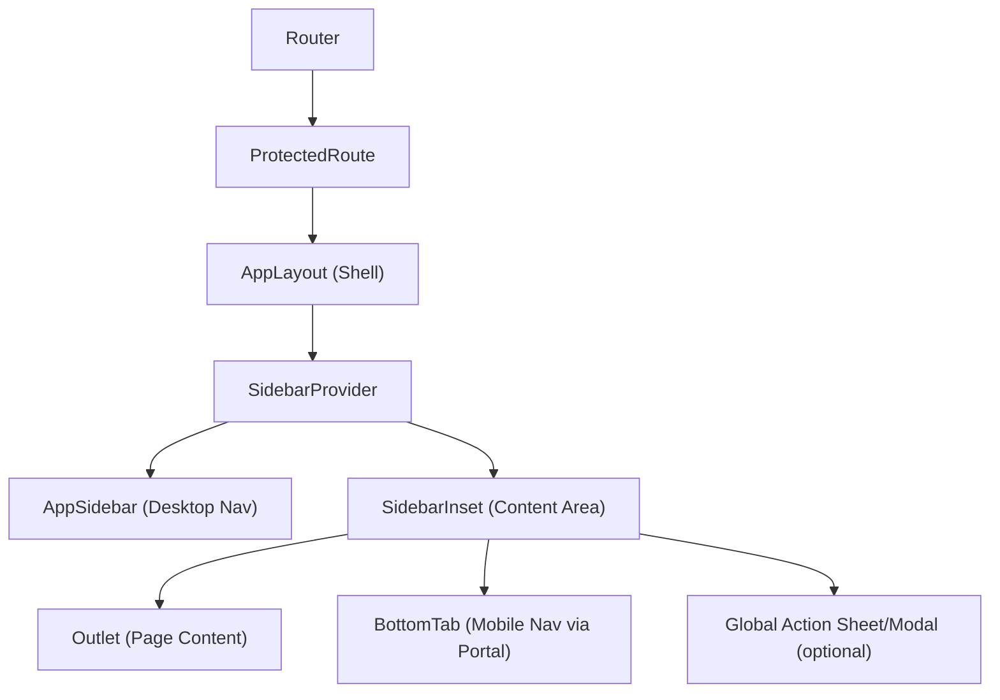

# Responsive Navigation Shell Pattern (Sidebar on Web, Bottom Tabs on Mobile)

## 1) Purpose

This document defines a reusable application shell pattern where:

- Desktop/tablet (`>= 768px`) uses a persistent **left sidebar**.
- Mobile (`< 768px`) uses a fixed **bottom tab bar**.

The pattern is designed for product apps with:

- 4 to 6 primary destinations.
- Frequent route switching.
- A need for stable navigation memory and mobile-thumb ergonomics.

It is based on the implementation in this repository and generalized so other projects can implement it safely.

## 2) Core UX Contract

- Navigation must feel native to each form factor:
- Desktop: persistent vertical nav, content-focused center panel.
- Mobile: bottom tabs always reachable by thumb.
- Route model must be shared between sidebar and bottom tabs.
- Active route state must be consistent across both nav surfaces.
- Main content must reserve bottom space on mobile so fixed tabs never overlap actionable UI.
- Safe-area insets (iOS notches/home indicator) must be handled.

## 3) High-Level Architecture



Key idea: `AppLayout` is the only place that composes navigation surfaces + route outlet.

## 4) Routing Contract

Keep routing structured like this:

1. Public routes outside shell (e.g. login).
2. Protected route guard.
3. Shell route wrapper.
4. Child page routes rendered in `Outlet`.

Example topology:

- `/login` -> public screen.
- `/` `/timeline` `/handbook` `/progress` `/more` -> protected + wrapped by shell.

Benefits:

- Navigation shell is mounted once for all authenticated pages.
- Sidebar/bottom-tabs are stable across route transitions.
- Shared layout state is preserved.

## 5) Shared Navigation Model

Define one source of truth for navigation items:

- `PATHS` constants for route URLs.
- `APP_MENU_ITEMS` for sidebar.
- `BOTTOM_TAB_ITEMS` for mobile tabs.

In many projects these can reference the same array if labels/icons are identical.

Each nav item should include:

- `label` (i18n-ready string).
- `path` (route target).
- `icon` (component token, not JSX instance).

### Active Route Rule

Use a stable rule:

- Home route: exact match only.
- Other routes: `pathname.startsWith(targetPath)`.

This supports nested pages like `/timeline/123` still activating `Timeline`.

## 6) Responsive Behavior Spec

### Breakpoint

- Mobile breakpoint is `768px`.
- `useIsMobile` returns `window.innerWidth < 768`.

### Visibility Rules

- Sidebar:
- Hidden on mobile by default (`hidden md:block` behavior).
- Shown on desktop as persistent panel.
- Bottom tabs:
- Hidden on desktop (`md:hidden` behavior).
- Fixed at viewport bottom on mobile.

### Layout Rules

- App wrapper uses `min-h-screen`.
- Main content container is scrollable (`overflow-y-auto`).
- Content bottom padding must account for fixed tab height:
- Mobile: larger bottom padding (`pb-32` in current implementation).
- Desktop: smaller bottom padding (`md:pb-12`).

## 7) Sidebar Layer (Web)

`AppSidebar` responsibilities:

- Render brand/header area.
- Render route menu with active-state styling.
- Provide contextual footer actions (e.g., create item, logout).
- Use `Link` navigation for semantic routing.

Desktop styling characteristics:

- Soft container background (`bg-sidebar` tokenized).
- Clear active indicator (left accent bar).
- Icon + label emphasis changes for active item.
- Smooth hover/active transitions.

### Optional Sidebar Behavior

If using a sidebar system like `SidebarProvider`:

- Support collapsed/expanded state.
- Persist state in cookie/local storage.
- Provide keyboard shortcut for toggle.

## 8) Bottom Tab Layer (Mobile)

`BottomTab` responsibilities:

- Render primary routes only.
- Use large touch-friendly tap targets.
- Visually indicate active tab via icon/text color.
- Render via `createPortal(..., document.body)` to avoid clipping by nested overflow containers.

Mobile styling characteristics:

- Fixed bottom container.
- Top border + blur/backdrop for separation.
- Rounded top corners.
- Safe-area bottom padding support.

### Why Portal Is Important

Without portal, bottom tabs may:

- Be clipped by parent `overflow-hidden`.
- Lose stacking context against dialogs/sheets.
- Shift unexpectedly inside nested layout containers.

Portal guarantees viewport-level placement.

## 9) Safe Area and Spacing Contract

Add CSS utilities for modern mobile devices:

- `pb-safe`: includes `env(safe-area-inset-bottom)`.
- `pt-safe`/`t-safe`: handle top notch inset.

Current implementation also uses legacy `constant(...)` for older Safari fallback.

Important: keep a minimum tab visual height independent of safe-area so UI remains consistent on devices without insets.

## 10) Content and Overlay Layering

Recommended z-index order:

1. Base content.
2. Sidebar shell.
3. Bottom tab.
4. Sheets/modals/dialogs.
5. Toasts/global overlays.

In this codebase:

- Bottom tabs use high fixed z-index.
- Form sheet uses a higher z-index than tabs.
- Toaster has top-level z-index.

This prevents bottom tabs from covering modal content.

## 11) Cross-Surface Actions

A common pattern:

- Sidebar footer has a primary action button (e.g. "Record").
- Same action is triggered from other mobile-friendly entry points.
- Action opens a global sheet/modal mounted at layout level.

Implementation principle:

- Store UI state centrally (e.g. Zustand store).
- Trigger action from any component.
- Keep the sheet component near shell root so it works on every route.

## 12) Recommended File Structure

```text
src/
  app.tsx
  routes/
    protected-route.tsx
  components/
    layout/
      app-layout.tsx
      app-sidebar.tsx
      bottom-tab.tsx
      app-back.tsx
      scroll-to-top.tsx
    ui/
      sidebar.tsx
  hooks/
    shared/
      use-mobile.ts
  lib/
    constants/
      paths.ts
      navigation.ts
  styles/
    index.css
```

## 13) Implementation Blueprint for Any Project

### Step 1: Define route and navigation constants

- Create route path constants.
- Create nav item descriptors (label/path/icon).
- Keep them framework-agnostic objects.

### Step 2: Create `AppLayout` shell

- Wrap with sidebar provider.
- Render sidebar component.
- Render content inset + route outlet.
- Mount bottom tabs once.
- Mount global sheets/dialogs once.

### Step 3: Implement desktop sidebar

- Menu list from nav constants.
- Active-state logic shared with bottom tabs.
- Footer action area optional.

### Step 4: Implement mobile bottom tabs

- Fixed + portal-based render.
- Tap targets at least 44x44.
- Active visual state.
- iOS safe-area padding.

### Step 5: Add spacing guarantees

- Main content bottom padding for tab overlap prevention.
- Top safe-area utility for floating top actions.

### Step 6: Add accessibility

- Use semantic `button`/`a` elements.
- Provide visible focus ring.
- Add `aria-label` when icon-only controls exist.
- Ensure color contrast for inactive tab/menu states.

### Step 7: Add QA matrix

- Route transitions on each tab.
- Deep-link active-state correctness.
- Rotation portrait/landscape on mobile.
- iOS Safari with home indicator.
- Android Chrome with gesture nav.
- PWA standalone mode if applicable.

## 14) Minimal Pseudocode

```tsx
function AppLayout() {
  return (
    <ShellProvider>
      <Sidebar className="hidden md:block" />
      <ContentInset>
        <main className="pb-mobile-tabs md:pb-desktop">
          <Outlet />
        </main>
        <BottomTabs className="fixed bottom-0 md:hidden" />
        <GlobalSheet />
      </ContentInset>
    </ShellProvider>
  )
}
```

## 15) Pitfalls and Fixes

### Pitfall A: Bottom tabs cover CTA/buttons

- Cause: missing bottom padding in main content.
- Fix: enforce shell-level mobile bottom padding token.

### Pitfall B: Wrong active state for nested routes

- Cause: exact-match for all routes.
- Fix: use exact for home, prefix match for non-home.

### Pitfall C: Tabs hidden behind overlays or clipped

- Cause: tabs rendered inside overflow container.
- Fix: render tabs via portal to `document.body`.

### Pitfall D: Safe-area looks broken on iPhone

- Cause: no `env(safe-area-inset-bottom)` handling.
- Fix: add safe-area utilities and verify in real device emulation.

### Pitfall E: Different nav item definitions drift

- Cause: sidebar and tabs maintained separately.
- Fix: centralize constants and derive both surfaces.

## 16) Testing Checklist (Production Ready)

- [ ] Desktop: sidebar visible at `>= 768px`.
- [ ] Mobile: bottom tabs visible at `< 768px`.
- [ ] No overlap between fixed tabs and page actions/content.
- [ ] Active item is correct for root and nested routes.
- [ ] Keyboard navigation works in sidebar.
- [ ] Touch target sizes are accessible on mobile.
- [ ] Safe-area behavior is correct on notch devices.
- [ ] Global modals/sheets appear above navigation.
- [ ] Navigation text is i18n-ready.

## 17) Mapping to This Repository

- Shell composition:
- `frontend/src/app.tsx`
- `frontend/src/components/layout/app-layout.tsx`
- Desktop nav:
- `frontend/src/components/layout/app-sidebar.tsx`
- Mobile nav:
- `frontend/src/components/layout/bottom-tab.tsx`
- Responsive detection:
- `frontend/src/hooks/shared/use-mobile.ts`
- Shared navigation constants:
- `frontend/src/lib/constants/paths.ts`
- `frontend/src/lib/constants/navigation.ts`
- Sidebar foundation component:
- `frontend/src/components/ui/sidebar.tsx`
- Safe-area + design tokens:
- `frontend/src/index.css`
- Mobile back button helper for non-tab routes:
- `frontend/src/components/layout/app-back.tsx`

## 18) Adoption Notes for Other Projects

- Keep the pattern, not the styling details.
- Replace visual tokens (`--sidebar`, `--surface-*`, etc.) with your design system.
- Keep route model + active-state logic + safe-area handling unchanged unless there is a strong reason.
- If your app has more than 6 primary destinations, combine bottom tabs with a "More" route to avoid overcrowding.

---

If you implement this pattern from scratch, start by stabilizing the route model and shell structure first. Visual refinements should come after behavior, spacing, and accessibility are fully correct.
